# 📚 DevOps & CI/CD Documentation

A comprehensive guide for setting up modern DevOps practices, from simple web apps to enterprise-scale platforms.

## 🎯 Quick Start

### For Your Ticket App (Current Project)

1. **Start Simple**: Use GitHub-hosted runners for CI/CD
2. **Deploy Easily**: Use Vercel or Netlify for hosting
3. **Scale Later**: Add self-hosted runners only when needed

### For Enterprise Projects

1. **Review Strategy**: Read the [CI/CD Runner Strategy](./cicd-runner-strategy.md)
2. **Setup Tools**: Follow the [DevOps Tooling Setup](./devops-tooling-setup.md)
3. **Implement Pipelines**: Use [Implementation Examples](./runner-implementation-examples.md)

---

## 📋 Documentation Overview

### 🏗️ Architecture & Strategy

- **[CI/CD Architecture Diagrams](./cicd-architecture-diagrams.md)** - Visual guides and flowcharts
- **[CI/CD Runner Strategy](./cicd-runner-strategy.md)** - When to use GitHub-hosted vs self-hosted runners
- **[DevOps Tooling Setup](./devops-tooling-setup.md)** - Install and configure essential DevOps tools

### 🛠️ Implementation Guides

- **[Runner Implementation Examples](./runner-implementation-examples.md)** - Real-world CI/CD pipeline configurations
- **[Comprehensive CI/CD Template](../.github/workflows/comprehensive-cicd-template.yml)** - Production-ready workflow template

---

## 🎯 Choose Your Path

### Path 1: Simple Web Application

**Perfect for:** Personal projects, startups, simple web apps

**Benefits:**

- ✅ Zero maintenance
- ✅ Free for public repos
- ✅ Fast setup (< 30 minutes)
- ✅ Perfect for MVP development

**Next Steps:**

1. Use the [simple CI/CD template](./runner-implementation-examples.md#1-ticket-app-current-project)
2. Deploy to Vercel or Netlify
3. Add security scans and testing

---

### Path 2: Enterprise SaaS Platform

**Perfect for:** Business applications, microservices, team projects

```mermaid
graph TB
    START[Your Project] --> HYBRID[Hybrid Runner Strategy]
    HYBRID --> GH[GitHub-Hosted: CI/Testing]
    HYBRID --> EC2[Self-Hosted: Infrastructure]
    GH --> DEPLOY[Deploy to EKS]
    EC2 --> DEPLOY
    DEPLOY --> DONE[✅ Complete]

    classDef enterprise fill:#fb8500,stroke:#d62d20,stroke-width:2px,color:#fff
    classDef github fill:#2ea043,stroke:#1a7f37,stroke-width:2px,color:#fff

    class START,HYBRID,EC2,DEPLOY,DONE enterprise
    class GH github
```

**Benefits:**

- ✅ Best of both worlds
- ✅ Cost-optimized
- ✅ Scalable infrastructure
- ✅ Production-ready security

**Next Steps:**

1. Follow the [DevOps tooling setup](./devops-tooling-setup.md)
2. Implement [hybrid CI/CD strategy](./cicd-runner-strategy.md#pattern-2-enterprise-saas-platform)
3. Set up EKS with proper add-ons

---

### Path 3: High-Security / Compliance

**Perfect for:** Financial services, healthcare, government, crypto

**Benefits:**

- ✅ Maximum security control
- ✅ Compliance-ready
- ✅ Private infrastructure
- ✅ Audit-friendly

**Next Steps:**

1. Set up [security-focused infrastructure](./runner-implementation-examples.md#3-sentinel-core-security-first-project)
2. Implement private CI/CD pipelines
3. Configure compliance monitoring

---

## 🛠️ Tools & Technologies Covered

### Core DevOps Tools

| Tool           | Purpose                 | Installation Guide                                                            |
| -------------- | ----------------------- | ----------------------------------------------------------------------------- |
| **AWS CLI v2** | AWS resource management | [Setup Guide](./devops-tooling-setup.md#-aws-cli-v2)                          |
| **Terraform**  | Infrastructure as Code  | [Setup Guide](./devops-tooling-setup.md#-terraform)                           |
| **kubectl**    | Kubernetes management   | [Setup Guide](./devops-tooling-setup.md#%EF%B8%8F-kubectl-kubernetes-cli)     |
| **eksctl**     | EKS cluster management  | [Setup Guide](./devops-tooling-setup.md#%EF%B8%8F-eksctl-eks-management-tool) |

### Kubernetes Add-ons

| Add-on             | Purpose                        | Setup Guide                                                                          |
| ------------------ | ------------------------------ | ------------------------------------------------------------------------------------ |
| **EBS CSI Driver** | Persistent storage             | [Setup Guide](./devops-tooling-setup.md#%EF%B8%8F-ebs-csi-driver-persistent-storage) |
| **NGINX Ingress**  | Load balancing & routing       | [Setup Guide](./devops-tooling-setup.md#-nginx-ingress-controller)                   |
| **cert-manager**   | SSL/TLS certificate management | [Setup Guide](./devops-tooling-setup.md#-cert-manager-ssltls-certificates)           |

### CI/CD Platforms

| Platform           | Use Case                | Runner Type                 |
| ------------------ | ----------------------- | --------------------------- |
| **GitHub Actions** | All projects            | GitHub-hosted + Self-hosted |
| **Vercel**         | Frontend deployment     | GitHub-hosted integration   |
| **AWS EKS**        | Container orchestration | Self-hosted runners         |

---

## 💰 Cost Considerations

### Monthly Cost Breakdown

| Setup Type          | GitHub Actions | EC2 Runners | Total Est.   |
| ------------------- | -------------- | ----------- | ------------ |
| **Simple Web App**  | $0-50          | $0          | **$0-50**    |
| **Enterprise SaaS** | $25-100        | $75-200     | **$100-300** |
| **High-Security**   | $0-25          | $200-500    | **$200-525** |

### Cost Optimization Tips

1. **Start Small**: Begin with GitHub-hosted, scale to self-hosted
2. **Use Spot Instances**: Save 60-90% on EC2 costs for non-critical jobs
3. **Hybrid Strategy**: Use GitHub-hosted for CI, self-hosted for deployment
4. **Auto-scaling**: Scale runners based on workload

---

## 🔐 Security Best Practices

### GitHub-Hosted Runners

- ✅ Use OIDC instead of long-lived AWS keys
- ✅ Limit permissions with least-privilege principle
- ✅ Never store sensitive data in GitHub Secrets
- ❌ Don't use for infrastructure management

### Self-Hosted Runners

- ✅ Use EC2 IAM roles (no hardcoded credentials)
- ✅ Run in private subnets with VPC endpoints
- ✅ Regular security updates and monitoring
- ✅ Network segmentation and access controls

---

## 🚀 Implementation Roadmap

### Phase 1: Foundation (Week 1)

- [ ] Set up GitHub repository structure
- [ ] Implement basic CI pipeline with GitHub-hosted runners
- [ ] Add security scanning (Trivy, Gitleaks)
- [ ] Deploy to staging environment

### Phase 2: Production (Week 2-3)

- [ ] Set up AWS infrastructure with Terraform
- [ ] Configure EKS cluster with essential add-ons
- [ ] Implement production deployment pipeline
- [ ] Add monitoring and logging

### Phase 3: Scale (Week 4+)

- [ ] Add self-hosted runners for infrastructure management
- [ ] Implement GitOps with ArgoCD
- [ ] Add advanced security and compliance features
- [ ] Optimize costs and performance

---

## 🤝 Support & Contribution

### Getting Help

1. **Review Documentation**: Start with the relevant guide above
2. **Check Examples**: Look at implementation examples for your use case
3. **Test Setup**: Use the verification scripts provided

### Contributing

- Submit issues for documentation improvements
- Share your implementation experiences
- Contribute additional examples and use cases

---

## 📚 Additional Resources

### External Documentation

- [GitHub Actions Documentation](https://docs.github.com/en/actions)
- [AWS EKS User Guide](https://docs.aws.amazon.com/eks/)
- [Terraform AWS Provider](https://registry.terraform.io/providers/hashicorp/aws/latest/docs)
- [Kubernetes Documentation](https://kubernetes.io/docs/)

### Best Practices

- [AWS Well-Architected Framework](https://aws.amazon.com/architecture/well-architected/)
- [CNCF Cloud Native Security](https://www.cncf.io/reports/cloud-native-security-whitepaper/)
- [DevOps Security Best Practices](https://owasp.org/www-project-devsecops-guideline/)

This documentation provides everything you need to implement modern DevOps practices, from simple deployments to enterprise-grade infrastructure. Choose your path and start building! 🚀
