# CI/CD Architecture Visualizations

## 🏗️ Complete CI/CD Architecture Flow

This diagram shows how experienced DevOps teams structure their CI/CD pipelines using both GitHub-hosted and self-hosted runners.

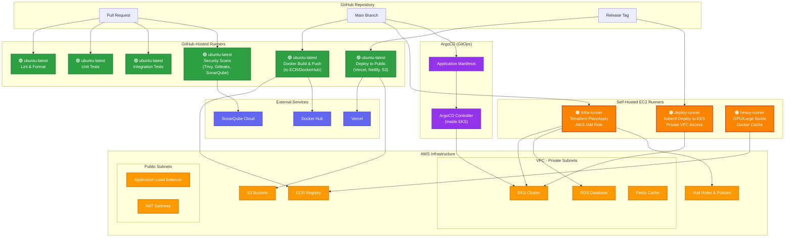

---

## 🎯 Decision Flow: Which Runner Should I Use?

Use this flowchart to quickly decide between GitHub-hosted and self-hosted runners for any CI/CD job.

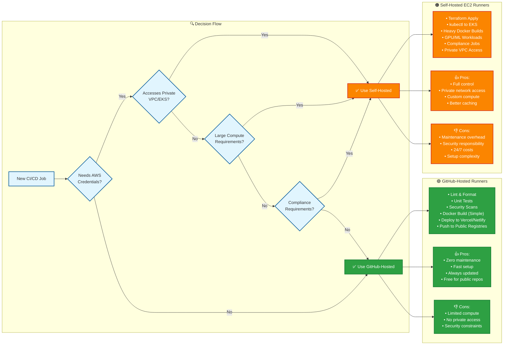

---

## 🏢 Project-Specific Architecture Patterns

### Simple Web App (Your Ticket App)

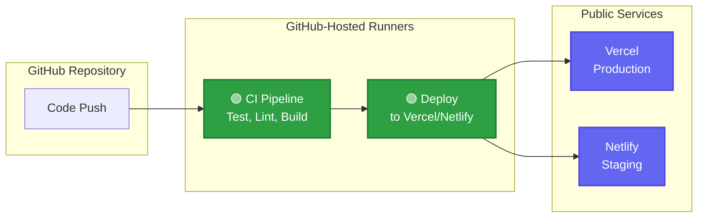

### Enterprise SaaS Platform

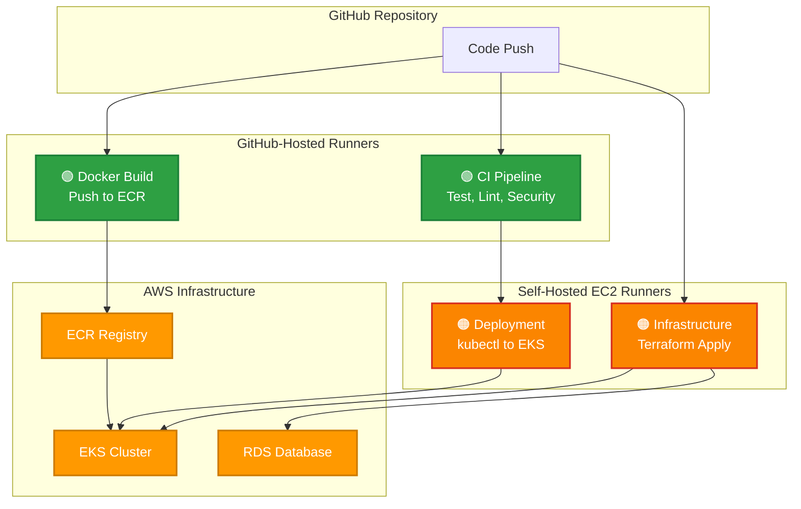

### AI/ML Platform

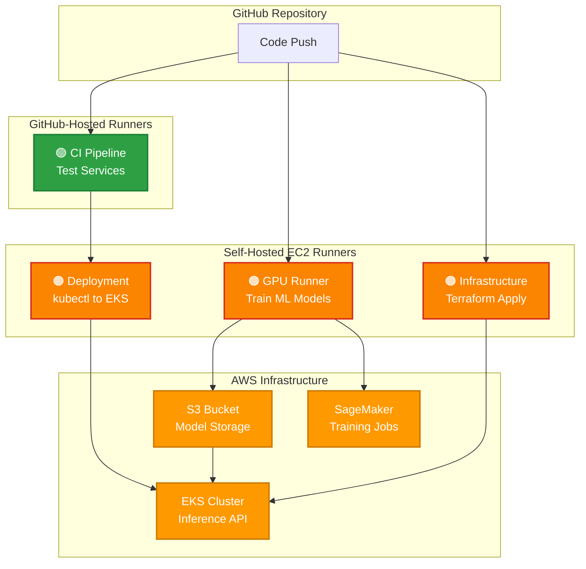

---

## 💰 Cost Comparison Visualization

### Monthly Runner Costs

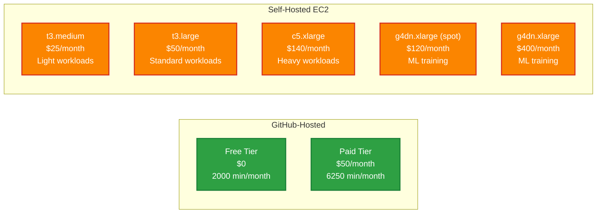

---

## 🔐 Security Architecture

### GitHub-Hosted Security Model

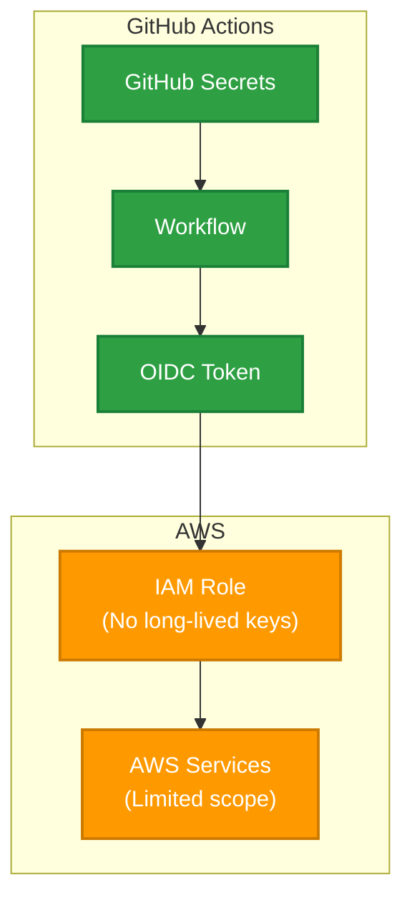

### Self-Hosted Security Model

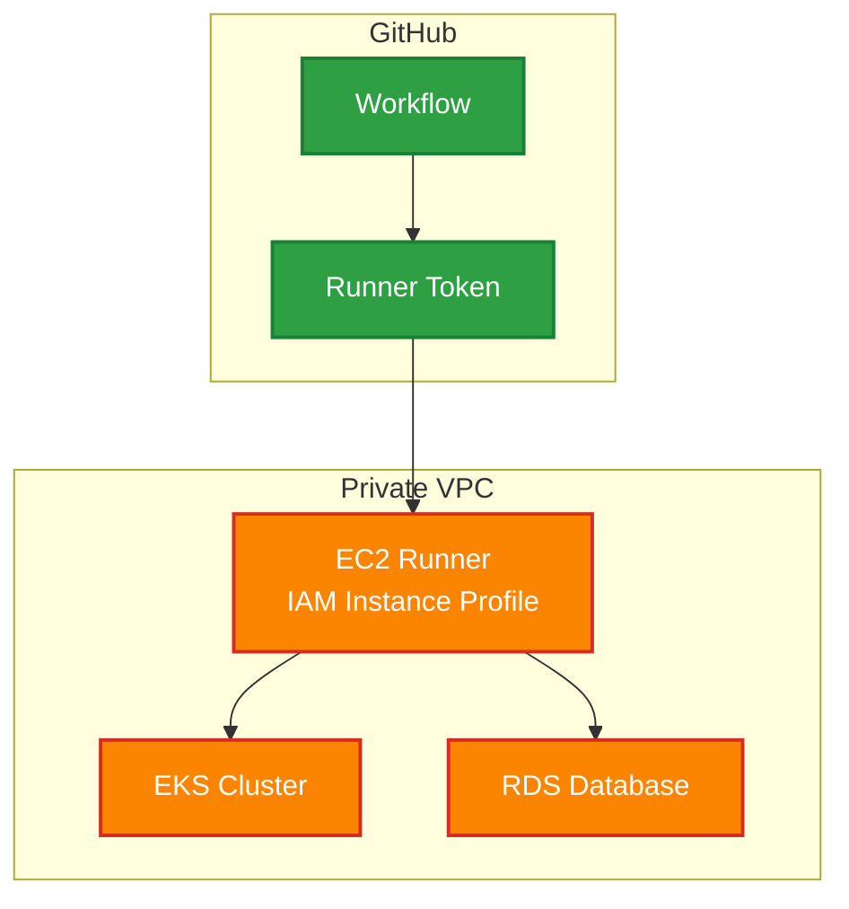

---

## 🔧 DevOps Tooling Architecture

This diagram shows how the DevOps tools integrate with your CI/CD runners and AWS infrastructure.

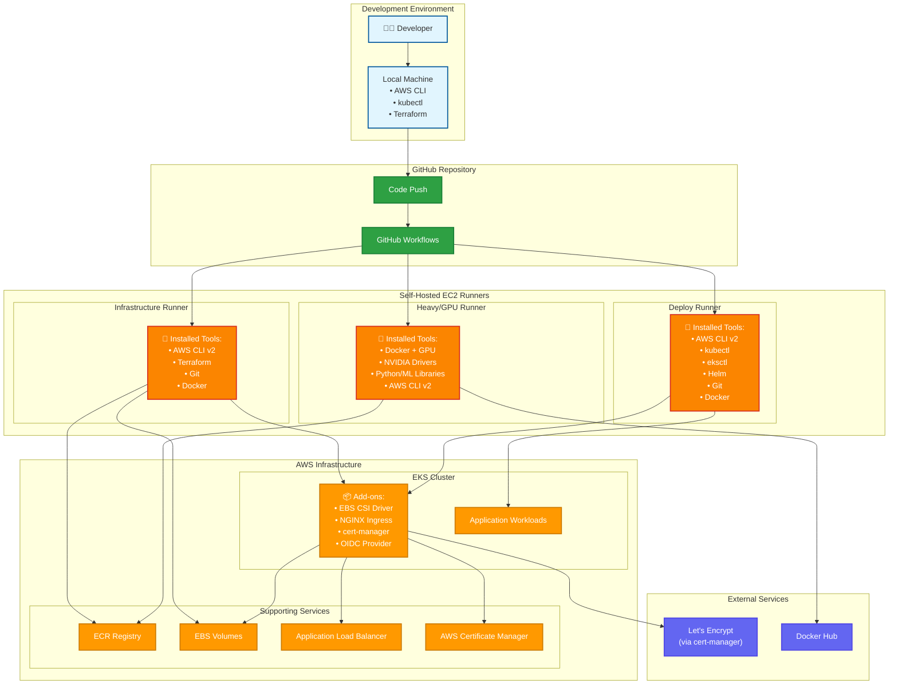

---

## 🛠️ Tool Installation Flow

This shows the sequence of setting up your DevOps environment:

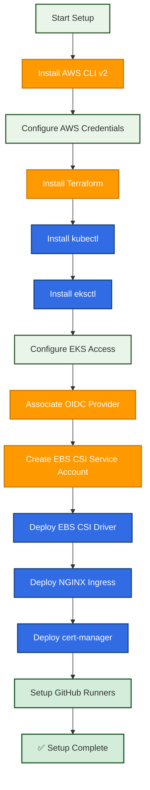

---

## 🔄 CI/CD Pipeline with Tooling Integration

This shows how the tools work together in your CI/CD pipeline:

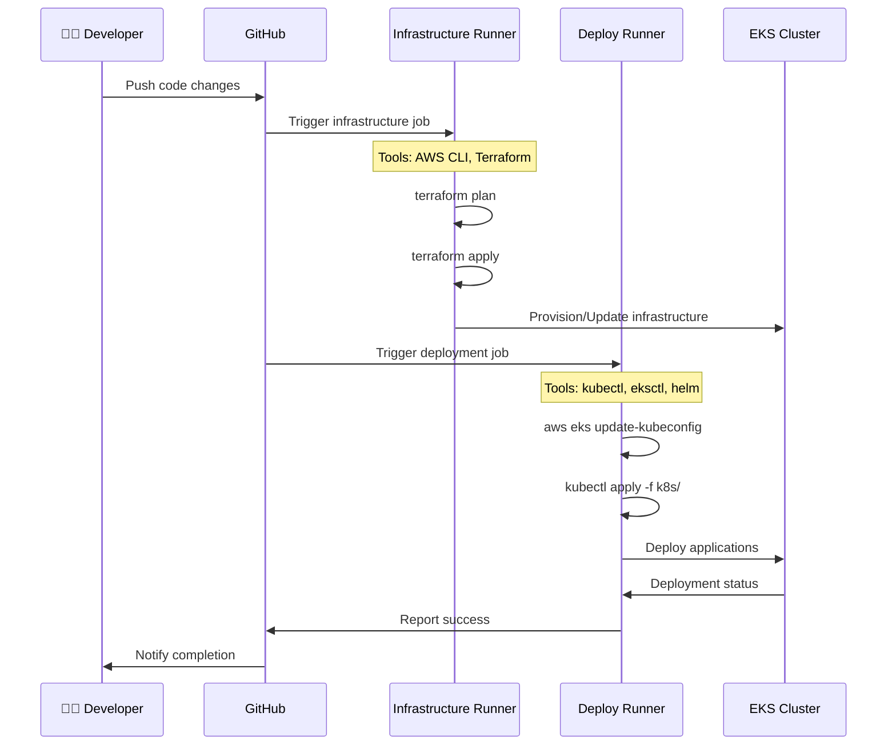

---

## 📋 How to View These Diagrams

### Option 1: GitHub (Recommended)

1. Push this file to your GitHub repository
2. View it directly on GitHub - it will render the Mermaid diagrams automatically

### Option 2: VS Code

1. Install the "Markdown Preview Mermaid Support" extension
2. Open this file in VS Code
3. Use `Ctrl+Shift+V` (or `Cmd+Shift+V` on Mac) to preview

### Option 3: Online Mermaid Editor

1. Copy any diagram code block
2. Go to https://mermaid.live/
3. Paste the code to see the rendered diagram

### Option 4: Export as Images

1. Use the Mermaid Live Editor
2. Click "Actions" → "Export SVG/PNG"
3. Save the diagrams as image files

These visualizations will help you quickly understand and explain your CI/CD architecture to team members, stakeholders, or when planning new projects!
