# CI/CD Architecture Visualizations

## 🏗️ Complete CI/CD Architecture Flow

This diagram shows how experienced DevOps teams structure their CI/CD pipelines using both GitHub-hosted and self-hosted runners.

---

## 🎯 Decision Flow: Which Runner Should I Use?

Use this flowchart to quickly decide between GitHub-hosted and self-hosted runners for any CI/CD job.

```mermaid
graph LR
    subgraph "🔍 Decision Flow"
        START[New CI/CD Job]
        Q1{Needs AWS<br/>Credentials?}
        Q2{Accesses Private<br/>VPC/EKS?}
        Q3{Large Compute<br/>Requirements?}
        Q4{Compliance<br/>Requirements?}

        START --> Q1
        Q1 -->|Yes| Q2
        Q1 -->|No| GH_RUNNER
        Q2 -->|Yes| EC2_RUNNER
        Q2 -->|No| Q3
        Q3 -->|Yes| EC2_RUNNER
        Q3 -->|No| Q4
        Q4 -->|Yes| EC2_RUNNER
        Q4 -->|No| GH_RUNNER
    end

    subgraph "🟢 GitHub-Hosted Runners"
        GH_RUNNER["✅ Use GitHub-Hosted"]
        GH_JOBS["• Lint & Format<br/>• Unit Tests<br/>• Security Scans<br/>• Docker Build (Simple)<br/>• Deploy to Vercel/Netlify<br/>• Push to Public Registries"]
        GH_PROS["👍 Pros:<br/>• Zero maintenance<br/>• Fast setup<br/>• Always updated<br/>• Free for public repos"]
        GH_CONS["👎 Cons:<br/>• Limited compute<br/>• No private access<br/>• Security constraints"]

        GH_RUNNER --> GH_JOBS
        GH_RUNNER --> GH_PROS
        GH_RUNNER --> GH_CONS
    end

    subgraph "🟠 Self-Hosted EC2 Runners"
        EC2_RUNNER["✅ Use Self-Hosted"]
        EC2_JOBS["• Terraform Apply<br/>• kubectl to EKS<br/>• Heavy Docker Builds<br/>• GPU/ML Workloads<br/>• Compliance Jobs<br/>• Private VPC Access"]
        EC2_PROS["👍 Pros:<br/>• Full control<br/>• Private network access<br/>• Custom compute<br/>• Better caching"]
        EC2_CONS["👎 Cons:<br/>• Maintenance overhead<br/>• Security responsibility<br/>• 24/7 costs<br/>• Setup complexity"]

        EC2_RUNNER --> EC2_JOBS
        EC2_RUNNER --> EC2_PROS
        EC2_RUNNER --> EC2_CONS
    end

    %% Styling
    classDef decision fill:#e1f5fe,stroke:#01579b,stroke-width:2px
    classDef github fill:#2ea043,stroke:#1a7f37,stroke-width:2px,color:#fff
    classDef ec2 fill:#fb8500,stroke:#d62d20,stroke-width:2px,color:#fff
    classDef info fill:#f5f5f5,stroke:#666,stroke-width:1px

    class START,Q1,Q2,Q3,Q4 decision
    class GH_RUNNER,GH_JOBS,GH_PROS,GH_CONS github
    class EC2_RUNNER,EC2_JOBS,EC2_PROS,EC2_CONS ec2
```

---

## 🏢 Project-Specific Architecture Patterns

### Simple Web App (Your Ticket App)

```mermaid
graph LR
    subgraph "GitHub Repository"
        CODE[Code Push]
    end

    subgraph "GitHub-Hosted Runners"
        CI["🟢 CI Pipeline<br/>Test, Lint, Build"]
        DEPLOY["🟢 Deploy<br/>to Vercel/Netlify"]
    end

    subgraph "Public Services"
        VERCEL["Vercel<br/>Production"]
        NETLIFY["Netlify<br/>Staging"]
    end

    CODE --> CI
    CI --> DEPLOY
    DEPLOY --> VERCEL
    DEPLOY --> NETLIFY

    classDef github fill:#2ea043,stroke:#1a7f37,stroke-width:2px,color:#fff
    classDef public fill:#6366f1,stroke:#4f46e5,stroke-width:2px,color:#fff

    class CI,DEPLOY github
    class VERCEL,NETLIFY public
```

### Enterprise SaaS Platform

```mermaid
graph TB
    subgraph "GitHub Repository"
        CODE[Code Push]
    end

    subgraph "GitHub-Hosted Runners"
        CI["🟢 CI Pipeline<br/>Test, Lint, Security"]
        BUILD["🟢 Docker Build<br/>Push to ECR"]
    end

    subgraph "Self-Hosted EC2 Runners"
        INFRA["🟠 Infrastructure<br/>Terraform Apply"]
        DEPLOY["🟠 Deployment<br/>kubectl to EKS"]
    end

    subgraph "AWS Infrastructure"
        EKS["EKS Cluster"]
        ECR["ECR Registry"]
        RDS["RDS Database"]
    end

    CODE --> CI
    CODE --> BUILD
    CODE --> INFRA
    CI --> DEPLOY
    BUILD --> ECR
    INFRA --> EKS
    INFRA --> RDS
    DEPLOY --> EKS
    ECR --> EKS

    classDef github fill:#2ea043,stroke:#1a7f37,stroke-width:2px,color:#fff
    classDef selfHosted fill:#fb8500,stroke:#d62d20,stroke-width:2px,color:#fff
    classDef aws fill:#ff9900,stroke:#cc7a00,stroke-width:2px,color:#fff

    class CI,BUILD github
    class INFRA,DEPLOY selfHosted
    class EKS,ECR,RDS aws
```

### AI/ML Platform

```mermaid
graph TB
    subgraph "GitHub Repository"
        CODE[Code Push]
    end

    subgraph "GitHub-Hosted Runners"
        CI["🟢 CI Pipeline<br/>Test Services"]
    end

    subgraph "Self-Hosted EC2 Runners"
        GPU["🟠 GPU Runner<br/>Train ML Models"]
        INFRA["🟠 Infrastructure<br/>Terraform Apply"]
        DEPLOY["🟠 Deployment<br/>kubectl to EKS"]
    end

    subgraph "AWS Infrastructure"
        EKS["EKS Cluster<br/>Inference API"]
        S3["S3 Bucket<br/>Model Storage"]
        SAGEMAKER["SageMaker<br/>Training Jobs"]
    end

    CODE --> CI
    CODE --> GPU
    CODE --> INFRA
    CI --> DEPLOY
    GPU --> S3
    GPU --> SAGEMAKER
    INFRA --> EKS
    DEPLOY --> EKS
    S3 --> EKS

    classDef github fill:#2ea043,stroke:#1a7f37,stroke-width:2px,color:#fff
    classDef selfHosted fill:#fb8500,stroke:#d62d20,stroke-width:2px,color:#fff
    classDef aws fill:#ff9900,stroke:#cc7a00,stroke-width:2px,color:#fff

    class CI github
    class GPU,INFRA,DEPLOY selfHosted
    class EKS,S3,SAGEMAKER aws
```

---

## 💰 Cost Comparison Visualization

### Monthly Runner Costs

---

## 🔐 Security Architecture

### GitHub-Hosted Security Model

### Self-Hosted Security Model

---

## 📋 How to View These Diagrams

### Option 1: GitHub (Recommended)

1. Push this file to your GitHub repository
2. View it directly on GitHub - it will render the Mermaid diagrams automatically

### Option 2: VS Code

1. Install the "Markdown Preview Mermaid Support" extension
2. Open this file in VS Code
3. Use `Ctrl+Shift+V` (or `Cmd+Shift+V` on Mac) to preview

### Option 3: Online Mermaid Editor

1. Copy any diagram code block
2. Go to https://mermaid.live/
3. Paste the code to see the rendered diagram

### Option 4: Export as Images

1. Use the Mermaid Live Editor
2. Click "Actions" → "Export SVG/PNG"
3. Save the diagrams as image files

These visualizations will help you quickly understand and explain your CI/CD architecture to team members, stakeholders, or when planning new projects!
